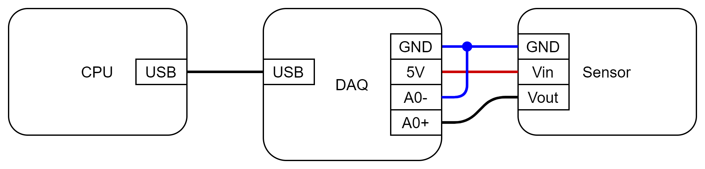

# Mechanical timepiece vibration analysis

The repository contains:

- Vibration capturing tool.
- Clock drift plotting tool.
- Time series cross-correlation plotting tool.
- Time series to audio conversion tool.
- 1 minute 200 ksps mechanical clock vibration sample (*Sample.npy*).
- 24h recording of the ticking timestamp of a 5 ticks per second mechanical clock (*Ticks.npy*).

The project requires the following circuit:

But should not be hard to adapt to a different one.

More info at this [link](https://therandomwalk.org/wp/accuracy-measurement-and-vibration-analysis-of-a-mechanical-timepiece/)
